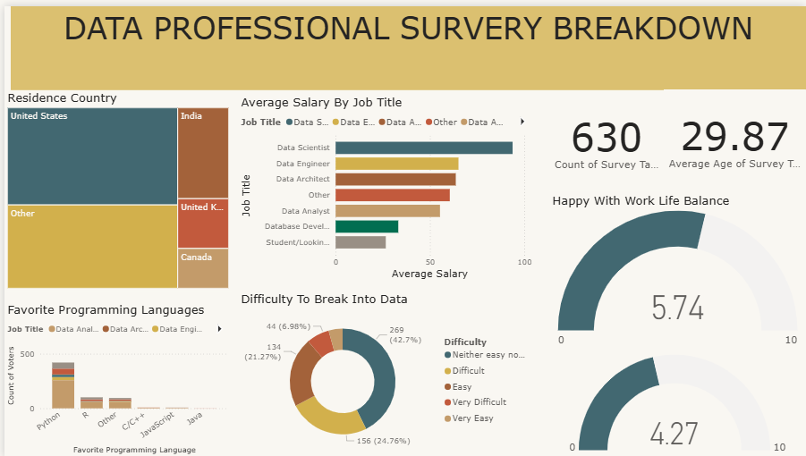

# Professional Survey Data Analysis
This project presents a dashboard analyzing a survey of data professionals, offering insights into their demographics, salaries, skills, and opinions on work-life balance and career entry. The analysis is performed using Microsoft Power BI.

----
## Overview

The dashboard provides a comprehensive view of the data professional landscape. Key metrics include:

- Total Survey Respondents: The number of individuals who participated in the survey.

- Average Age: The average age of the respondents.

- Geographic Distribution: The countries with the highest concentration of respondents (e.g., United States, India).

- Job Titles and Average Salary: A breakdown of average salaries by job title, highlighting the top-earning roles.

- Programming Language Preferences: The most popular programming languages among data professionals.
  

- Career Difficulty Perception: An analysis of how difficult professionals find it to enter the data field.
  

- Work-Life Balance: The average rating for happiness with work-life balance

----

## Usage

To view and interact with the dashboard, you need to have Microsoft Power BI Desktop installed.

1. Clone The Repository

2. Open the file:

>- Navigate to the cloned directory.

>- Open the .pbix file with Power BI Desktop.
-----

## Results

The dashboard provides a visual summary of the survey data, as shown below.

Key insights from the dashboard include:

- The survey had 630 respondents with an average age of 29.87 years.

- The majority of respondents are from the United States and India.

- Data Scientist is a prominent job title among the participants.

- The most favored programming language is Python, followed by R, C/C++, and Java.

- The average happiness with work-life balance is rated at 5.74 out of 10.

